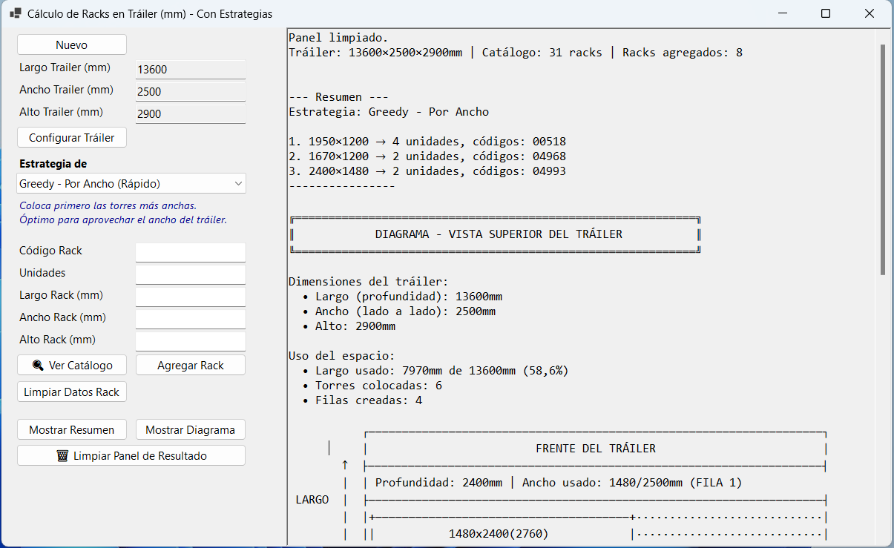

# CalculoRacksTrailerDesktop

Aplicación de escritorio (Windows Forms) para calcular y ubicar racks dentro de un tráiler. Permite cargar un catálogo CSV de racks, agregar unidades y simular colocación usando distintas estrategias de empaquetado.

## Características
- Validación de códigos y unidades.
- Simulación de colocación con estrategias (Greedy, BestFit).
- Generación de resumen y diagrama de disposición.
- Tests unitarios incluidos.

## Requisitos
- .NET 10 SDK
- Visual Studio 2022+ (recomendado) o cualquier editor compatible con .NET

## Instalación y ejecución
1. Clonar el repositorio:
   git clone https://github.com/ricardo91/CalculoRacksTrailerDesktop.git

2. Compilar:
   dotnet build

3. Ejecutar la aplicación (desde el proyecto principal):
   dotnet run --project CalculoRacksTrailerDesktop/CalculoRacksTrailerDesktop.csproj

## Ejecutar tests
- Ejecutar todos los tests:
  dotnet test

- Ejecutar tests de la solución o de un proyecto específico:
  dotnet test ./CalculoRacksTrailerDesktop.Tests/CalculoRacksTrailerDesktop.Tests.csproj

- Ejecutar un test concreto:
  dotnet test --filter "FullyQualifiedName=CalculoRacksTrailerDesktop.Tests.V2.Services.RackServiceTests.AddRack_ShouldReturn_PlacementFailed_WhenPlacementFails"

## Uso
- Colocar `racks_catalog.csv` en la carpeta del ejecutable o usar el ejemplo que se crea automáticamente.
- En la UI introducir el `Código` y `Unidades`, seleccionar estrategia y pulsar "Agregar".
- Revisar el panel de resultados y el diagrama superior.

## Estructura (resumen)
- `CalculoRacksTrailerDesktop/` — Aplicación principal (WinForms).
- `CalculoRacksTrailerDesktop.Tests/` — Tests unitarios (MSTest).
- `CalculoRacksTrailerDesktop/V2/Services/` — Lógica de negocio (`RackService`).
- `CalculoRacksTrailerDesktop/V1/` — Implementación auxiliar (`TrailerCalculator`, `Group`, etc.).

## Contribuir
- Abrir issue para proponer cambios o reportar bugs.
- Hacer fork, crear una rama con la mejora y enviar pull request.
- Mantener consistencia con el estilo del proyecto y añadir tests para cambios lógicos.

## Licencia
- Este proyecto se distribuye bajo la Licencia MIT. Consulta el archivo `LICENSE` en la raíz del repositorio para el texto legal completo.
